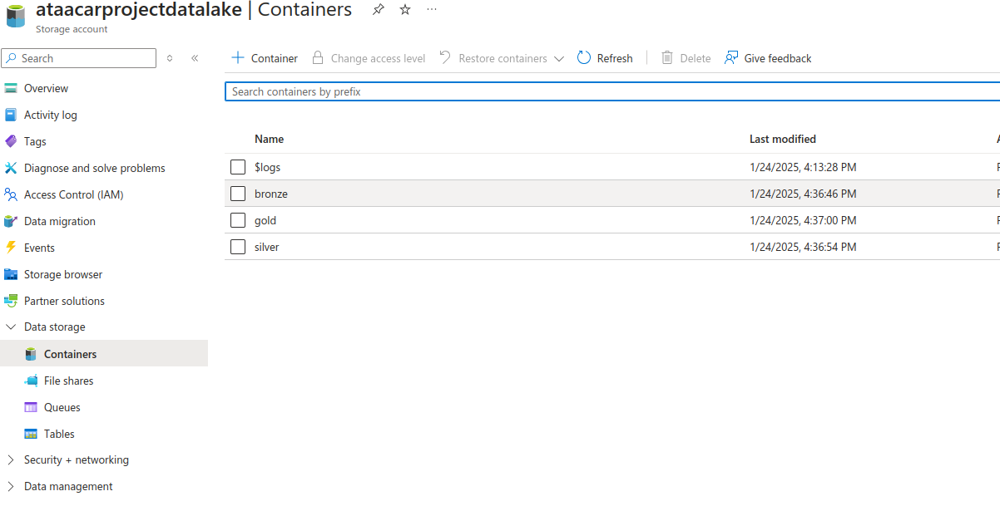

# Car Sales Data Lakehouse: Azure - Databricks eTe Project

This project is built using Azure Data Factory - Azure Databricks and Delta Lake to create a data lakehouse for car sales data. The project is divided into different layers to ensure data quality, consistency, and performance.

## ELT Layers

### 1. Ingestion or Extraction
First we move the data from the githup repo into Azure sql db, using connectore provided by azure
and Azure Data Factory, we will the data to our structred schema at Azure sql db.

### 2. Loading 

Here we will apply CDC to incrementally load the mew data from the Azure sql db to the Data lake.
using the max date in the data and after the intitaila load, we will loaf only the new records amd update the water_mark date at the database with the current max_date for the next run.

### 3. Transformation

In this layer we will laverage the power of databricks and pyspark to apply and complete the setup of our Lakehouse soloution and get the dimensions and fact out from those files.

### Bronze 
- **Description**: This layer contains raw data ingested from our source.
- **Storage**: Azure Data Lake Storage Gen2 (ADLS) in Parquet format.
- **Purpose**: Landing zone To store raw, unprocessed data.
- **Data writing**: overwrite, contains only the new data.

### Silver 
- **Description**: This layer contains cleaned and transformed data.
- **Storage**: ADLS in Parquet format.
- **Purpose**: To provide a refined, cleansed dataset that is ready for further processing and analysis.
- **Data writing**: overwrite, contains only the new data.

### Gold 
- **Description**: This layer contains the dimensonal model tables.
- **Storage**: ADLS in Delta-table format.
- **Purpose**: To provide high-quality data ready for reporting and analytics.
- **Data writing**: upsert, contains the whole data and also the previous versions.

and here are the notebooks managed and automated with databricks workflows

## Conclusion

This project demonstrates how to build a data lakehouse using Azure Databricks and Delta Lake. By organizing data into different layers, we ensure data quality and performance for analytics and reporting.
